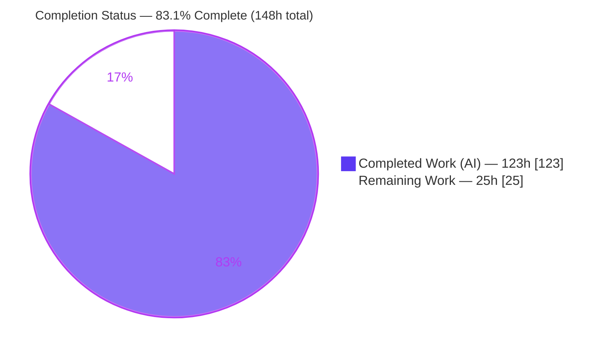
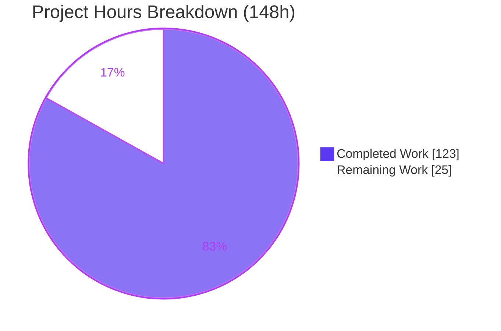
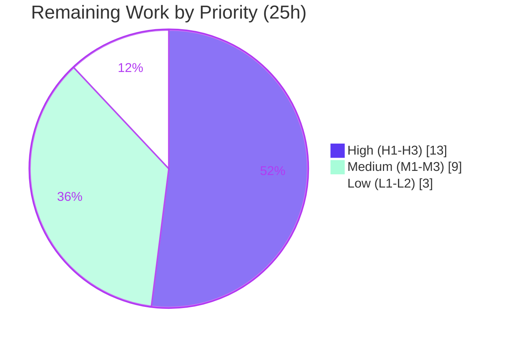

# Blitzy Project Guide — Netflix Chaos Monkey v2: Native Argo CD (GitOps) Awareness

---

## 1. Executive Summary

### 1.1 Project Overview

This project adds **native Argo CD (GitOps) awareness** to Netflix Chaos Monkey v2 as an additive, opt-in, client-side integration. It lets Chaos Monkey coordinate chaos experiments with Argo CD deployment state so it never injects failures into workloads Argo CD considers unstable, and it records chaos actions on the shared GitOps timeline. Three capabilities are delivered: (A) target resolution mapping a termination target to its governing Argo CD `Application`; (B) a pre-flight sync/health gate that permits a termination only when the `Application` is `Synced` and `Healthy`, fail-closed otherwise; and (C) a best-effort, non-blocking event write-back annotation. When Argo CD is unconfigured the feature is completely inert and existing behavior is byte-for-byte preserved.

### 1.2 Completion Status

The completion percentage is calculated using the AAP-scoped hours methodology: `Completed Hours / (Completed + Remaining) × 100`. All Agent Action Plan deliverables are complete and independently verified; the remaining hours are exclusively the human-only path-to-production activities that cannot be performed autonomously (no real Argo CD cluster, credentials, or production environment were available to the agents).



**Color key:** Completed / AI Work = Dark Blue `#5B39F3`; Remaining / Not Completed = White `#FFFFFF`.

| Metric | Hours |
|--------|-------|
| **Total Hours** | **148** |
| **Completed Hours (AI + Manual)** | **123** (123 AI + 0 Manual) |
| **Remaining Hours** | **25** |
| **Percent Complete** | **83.1%** |

### 1.3 Key Accomplishments

- ✅ **Capability A — Target resolution** implemented in `argocd/mapper.go`: correlates a termination target against the authoritative `status.resources[]` of every eligible Argo CD `Application`, proving global uniqueness and failing closed on ambiguity/no-match.
- ✅ **Capability B — Sync/health gate** implemented in `argocd/precheck.go` + `term/term.go`: allows a termination only when the governing `Application` is `Synced` **and** `Healthy`; fail-closed graceful deny for every other state.
- ✅ **Capability C — Event write-back** implemented in `argocd/tracker.go`: best-effort PATCH of the `chaosmonkey.netflix.com/last-termination` annotation; `Track` always returns `nil` so a write-back error never blocks a termination.
- ✅ **Opt-in inertness**: allow-all `Precheck` + no-op tracker when `argocd.enabled=false`; all existing safety controls (`enabled`/`leashed`/outage/account/exception/whitelist/min-time) preserved byte-for-byte.
- ✅ **Zero new third-party dependencies**: the client uses only the Go standard library (`net/http`, `encoding/json`, `crypto/tls`, `context`, `time`) plus the pre-existing `github.com/pkg/errors`.
- ✅ **Security hardening**: credential redaction, 64 KiB bounded token-file reads, TOCTOU-safe descriptor validation, endpoint validation (no cleartext/userinfo), HTTP/2 disabled, and log-injection sanitization.
- ✅ **Quality gates green (independently re-verified)**: `go build ./...`, `go vet`, `gofmt`, `golint`, `errcheck`, and `mkdocs build --strict` all clean; **238/238 unit tests pass**, race detector clean, argocd coverage **93.2%**.
- ✅ **Documentation delivered**: new `docs/plugins/ArgoCD.md` (325 lines) plus `README.md`, `docs/Configuration-file-format.md`, and `mkdocs.yml` updates.

### 1.4 Critical Unresolved Issues

There are **no code-level blockers** — the feature compiles cleanly and all tests pass. The items below are path-to-production gaps, not defects.

| Issue | Impact | Owner | ETA |
|-------|--------|-------|-----|
| Feature validated only against a mocked Argo CD API (`httptest`) | Real Argo CD API response shape/semantics unverified across v2.x versions | Platform/SRE | H2 — 8h |
| Real Argo CD credentials/endpoint/CA not yet provisioned | Feature is inert in production until configured | SRE/Security | H1 — 3h |
| No production observability for gate decisions | Silent chaos-coverage drop if Argo CD is unreachable (fail-closed) | SRE/Ops | M3 — 2h |

### 1.5 Access Issues

| System/Resource | Type of Access | Issue Description | Resolution Status | Owner |
|-----------------|----------------|-------------------|-------------------|-------|
| Argo CD API server | Bearer credential + endpoint | No real Argo CD endpoint or token available to agents; all validation used a mock API | Open — requires human provisioning (task H1) | SRE/Security |
| Argo CD cluster | Network/cluster access | No live cluster for end-to-end integration testing | Open — requires human environment (task H2) | Platform/SRE |
| Source repository | Git write/merge | Branch fully committed; merge to `master` requires human approval | Open — requires reviewer (task H3) | Repo maintainers |

All other build/test resources were fully accessible; no repository-permission or tooling access issues affected autonomous validation.

### 1.6 Recommended Next Steps

1. **[High]** Provision a least-privilege Argo CD project-role token, endpoint, and CA bundle; populate the `[argocd]` config (task H1, 3h).
2. **[High]** Run an end-to-end integration test against a live Argo CD cluster: verify `Application` decoding, gate ALLOW/DENY, and the write-back annotation in the Argo CD UI (task H2, 8h).
3. **[High]** Complete code review of the 29-file additive diff and merge to `master` (task H3, 2h).
4. **[Medium]** Perform a security sign-off and a leashed staging soak to observe real instance→`Application` resolution and tune `argocd.timeout` (tasks M1 + M2, 7h).
5. **[Medium]** Add an operational runbook and log-based alerting on gate-deny spikes (task M3, 2h).

---

## 2. Project Hours Breakdown

### 2.1 Completed Work Detail

All completed hours are autonomous (AI) work by Blitzy agents; 0 manual hours. Every component traces to a specific AAP requirement.

| Component | Hours | Description |
|-----------|-------|-------------|
| Argo CD REST client (`argocd/client.go`) | 14 | `net/http` client: Bearer/session auth, configurable `crypto/tls` (CA / InsecureSkipVerify), HTTP/2 disabled, endpoint validation, `GET /api/v1/applications/{name}`, best-effort PATCH, credential encapsulation/redaction |
| Application status model (`argocd/application.go`) | 6 | JSON structs for `sync.status`/`health.status`/`resources[]` + status constants + nil-safe fail-closed helpers `IsSynced`/`IsHealthy`/`HasLiveResources` |
| **Capability A** — Target resolution mapper (`argocd/mapper.go`) | 12 | instance→governing `Application` resolution via `status.resources[]`, global-uniqueness proof, fail-closed on ambiguity/no-match |
| **Capability B** — Sync/health pre-flight gate (`argocd/precheck.go`) | 9 | allow-all when disabled; sole allow path `IsSynced() && IsHealthy()`; fail-closed graceful deny; nil-safety; context timeout; log sanitization; `deps.GetPrecheck` registration |
| **Capability C** — Event write-back tracker (`argocd/tracker.go`) | 9 | best-effort PATCH of `chaosmonkey.netflix.com/last-termination` via `ApplicationPatchRequest`; `Track` always returns `nil`; bounded timeout; TOCTOU-safe target |
| Configuration surface (`argocd/config.go` + `config/param` + `config/monkey.go`) | 12 | typed `[argocd]` view, 9 param keys, 9 accessors, defaults (`enabled=false`), TOCTOU-safe token-file read, redaction, validation |
| Core wiring & dependency injection (8 files) | 8 | `chaosmonkey.go` (Precheck interface + `Termination.Target`), `deps/deps.go`, `term/term.go` gate, `tracker/tracker.go` case, `command/chaosmonkey.go`, `cmd/chaosmonkey/main.go` blank-import |
| argocd unit test suite (`argocd/*_test.go`) | 26 | 3,124 LOC, 75 top-level test funcs, 180 run entries, `httptest`-mocked; 93.2% coverage; maps 1:1 to AAP §0.5.3 |
| Wiring test updates (`term/terminate_test.go`, `tracker/tracker_test.go`) | 5 | +120 gate tests, +103 tracker tests |
| Documentation (`docs/plugins/ArgoCD.md`, `README.md`, config-format, `mkdocs.yml`) | 8 | 325-line plugin doc: enabling, keys, gate/write-back behavior, auth/TLS, RBAC, edge cases |
| Build/dependency resolution for Go 1.20 (`go.mod`/`go.sum`) | 2 | `golang.org/x/sys` indirect version resolution; no new third-party deps |
| QA & security hardening iterations (14 commits) | 10 | multiple code-review/QA rounds (C/M/Q/F/D findings), hardening, doc-truthfulness fixes |
| Argo CD API research (AAP §0.2.2) | 2 | `Application` CRD status model, REST/auth model, Notifications engine |
| **Total Completed** | **123** | |

### 2.2 Remaining Work Detail

Each category is a path-to-production activity that requires a human and a real environment. Totals reconcile with Section 1.2 (Remaining = 25h) and Section 7.

| Category | Hours | Priority |
|----------|-------|----------|
| Real Argo CD cluster integration test (live API decoding, gate ALLOW/DENY, UI annotation verification) | 8 | High |
| Credential & TLS provisioning (least-privilege project-role token / session / token_file, CA bundle) | 3 | High |
| PR review & merge of the 29-file additive diff to `master` | 2 | High |
| Security review sign-off (credential handling, redaction, endpoint/TLS, log sanitization) | 3 | Medium |
| Staging soak / canary (enable `[argocd]` leashed, observe resolution + write-back, tune timeout) | 4 | Medium |
| Operational runbook & alerting (enable/disable procedure, monitor skip reasons, alert on deny spikes) | 2 | Medium |
| Argo CD Notifications subscription validation with a real notifications-controller (optional) | 2 | Low |
| Address pre-existing noted-not-fixed items if the team elects (out-of-scope per Minimal Change Clause) | 1 | Low |
| **Total Remaining** | **25** | |

### 2.3 Hours Reconciliation

- Section 2.1 Completed = **123h**; Section 2.2 Remaining = **25h**; Total = **148h** (matches Section 1.2).
- Completion % = 123 / 148 = **83.1%** (matches Sections 1.2, 7, 8).

---

## 3. Test Results

All tests below originate from Blitzy's autonomous validation logs for this project and were independently re-executed during this assessment (Go 1.20.14). Unit total: **238 pass / 0 fail** (130 top-level + 108 subtests). Integration total: **14/14** MySQL tests pass under `-tags docker` with MySQL 8.0. Combined: **252 tests, 100% pass**.

| Test Category | Framework | Total Tests | Passed | Failed | Coverage % | Notes |
|---------------|-----------|-------------|--------|--------|-----------|-------|
| Unit — argocd package | Go `testing` + `net/http/httptest` | 180 | 180 | 0 | 93.2% | 75 top-level funcs; gate allow/deny/fail-closed, mapper resolution, tracker best-effort, inert-when-disabled |
| Unit — tracker | Go `testing` | (incl. in package total) | ✓ | 0 | 92.9% | `case "argocd"` factory + best-effort behavior |
| Unit — term | Go `testing` | (incl. in package total) | ✓ | 0 | 71.4% | nil-guarded gate placement, fail-closed path |
| Unit — all packages | Go `testing` | 238 | 238 | 0 | — | 13 packages ok / 0 fail |
| Integration — MySQL | Go `testing` `-tags docker` + MySQL 8.0 | 14 | 14 | 0 | — | `--default-authentication-plugin=mysql_native_password` |
| Race detection | `go test -race` (argocd/term/tracker) | — | clean | 0 | — | no data races |
| **Combined total** | — | **252** | **252** | **0** | — | 100% pass |

**Static analysis (all clean, exit 0):** `go vet`, `gofmt` (Makefile-scoped, excludes `/migration`), `golint`, `errcheck -ignore 'io:Close' -ignoretests`, and `mkdocs build --strict`.

---

## 4. Runtime Validation & UI Verification

Chaos Monkey v2 is a command-line/cron batch binary with **no administrative web UI**; the only user-visible surface is the write-back annotation that appears in Argo CD's own UI/timeline (a surface owned by Argo CD, not built here). Runtime validation therefore focuses on the binary and the end-to-end gate/write-back path against a mocked Argo CD API.

- ✅ **Operational** — Binary builds (`go build -o chaosmonkey ./cmd/chaosmonkey`) and runs, listing existing subcommands (`migrate | schedule | terminate | fetch-schedule | outage | config | email | eligible | intest`). No new subcommand added, confirming AAP scope.
- ✅ **Operational** — Gate ALLOW path: with a mock Argo CD returning `Synced` + `Healthy`, the target resolves and the termination is permitted.
- ✅ **Operational** — Gate DENY path: with `OutOfSync`/`Progressing`/etc., the gate skips gracefully (nil error, never crashes the scheduler).
- ✅ **Operational** — Inert path: with `argocd.enabled=false`, the allow-all `Precheck` and no-op tracker preserve existing behavior byte-for-byte.
- ✅ **Operational** — Write-back path: the tracker PATCHes the `chaosmonkey.netflix.com/last-termination` annotation and returns `nil` even on failure (best-effort).
- ⚠ **Partial** — End-to-end validation against a **real** Argo CD cluster and verification of the annotation in the live Argo CD UI is pending (path-to-production task H2).
- ⚠ **Partial** — `./chaosmonkey terminate` requires a Spinnaker endpoint in config (pre-existing requirement); full runtime exercise needs a populated `chaosmonkey.toml`.

---

## 5. Compliance & Quality Review

Cross-mapping of AAP deliverables and governing rules to their verified status. Fixes applied during autonomous validation are noted.

| AAP / Rule Requirement | Benchmark | Status | Progress |
|------------------------|-----------|--------|----------|
| Capability A — target resolution (`mapper.go`) | Resolves instance→`Application` via `status.resources[]`, global uniqueness, fail-closed | ✅ Pass | 100% |
| Capability B — sync/health gate (`precheck.go` + `term.go`) | Allow only `Synced`+`Healthy`; fail-closed otherwise; additive placement | ✅ Pass | 100% |
| Capability C — event write-back (`tracker.go`) | Best-effort annotation; `Track` returns `nil` always | ✅ Pass | 100% |
| Fail-closed safety | API error/missing/empty/unreachable/403/404 → deny, never crash | ✅ Pass | 100% |
| Opt-in inertness | Disabled → allow-all + no-op; existing behavior byte-for-byte | ✅ Pass | 100% |
| Backward compatibility | Optional TOML section; existing config/CLI/MySQL schema unchanged | ✅ Pass | 100% |
| Non-blocking write-back | Tracker swallows own errors | ✅ Pass | 100% |
| Client-side only | Read (GET) + best-effort PATCH; no sync/rollback/refresh | ✅ Pass | 100% |
| Dependency conservatism | Go stdlib only; no new third-party deps | ✅ Pass | 100% |
| Minimal-change discipline | 8 additive, comment-annotated wiring edits; new logic isolated in `argocd/` | ✅ Pass | 100% |
| Established plugin pattern | `init()` registration + blank-import, mirroring outage/tracker/constrainer | ✅ Pass | 100% |
| Reuse existing contracts | Uses `chaosmonkey.Tracker`; adds exactly one new `Precheck` contract | ✅ Pass | 100% |
| Code conventions & testing style | `pkg/errors` wrapping; table-driven `testify` tests; gofmt/golint/errcheck/vet clean | ✅ Pass | 100% |
| Build & test criteria (§0.5.3) | `go build ./...` + `go test ./...` pass; MySQL gated behind `-tags docker` | ✅ Pass | 100% |
| Documentation | `ArgoCD.md` + config-format + README + mkdocs nav; `mkdocs --strict` exit 0 | ✅ Pass | 100% |

**Fixes applied during autonomous validation:** iterative code-review/QA rounds resolved hardening findings (C-01..C-06, M-01..M-07, Q-09..Q-17, F1..F7, D-1): credential encapsulation/redaction, bounded reads, TOCTOU-safe file access, endpoint validation, HTTP/2-off, log-injection sanitization, nil-safety, and TOCTOU-safe target carry via `Termination.Target`. A pre-existing `mysql_test.go` compile issue flagged during setup was fixed to unblock the docker-tagged suite.

**Outstanding (human):** security sign-off (M1), real-environment validation (H2), operational observability (M3).

**Noted-not-fixed pre-existing items (per Minimal Change Clause):** `config` subcommand's eager MySQL init; docs extension-less-link INFO notices (project-wide style, non-blocking); `chaosmonkey.go` `Group.String()` panic idiom; `migration/migrations.go` gofmt (intentionally excluded from Makefile fmt/lint); 2 benign stale `go.sum` entries.

---

## 6. Risk Assessment

| Risk | Category | Severity | Probability | Mitigation | Status |
|------|----------|----------|-------------|-----------|--------|
| T1 — Feature validated only against mocked Argo CD API; real v2.x shape/semantics may differ | Technical | Medium | Low-Medium | Real-cluster integration test (H2); defensive decoding already in place | Open (path-to-prod) |
| T2 — Pre-existing `migration/migrations.go` gofmt flag | Technical | Low | Low | Intentionally excluded from Makefile fmt/lint; noted-not-fixed | Open (out-of-scope) |
| T3 — Go version drift (module 1.19, built/tested 1.20.14) | Technical | Low | Low | build + 238 tests pass on 1.20; add CI matrix | Mitigated |
| T4 — Resolution latency for large/many eligible apps | Technical | Low | Low | `argocd.timeout` whole-operation budget caps evaluation | Mitigated |
| S1 — Bearer-credential exposure | Security | High | Low | Token redaction, `token_file` precedence, 64 KiB bounded read, TOCTOU-safe stat-after-open, non-regular-file refusal, insecure-perms warning | Mitigated (pending sign-off) |
| S2 — `insecure_skip_verify=true` misuse in production (MITM) | Security | Medium | Medium | Default `false`, `ca_cert` option, documented warning | Mitigated by default |
| S3 — Log injection via Argo CD status strings | Security | Low | Low | `sanitizeForLog` strips/escapes control chars, caps length | Mitigated |
| S4 — Endpoint validation (cleartext/userinfo/redirect) | Security | Medium | Low | `validateEndpoint` rejects cleartext/userinfo; HTTP/2 disabled | Mitigated |
| O1 — Silent chaos-coverage drop if Argo CD unreachable (fail-closed denies all governed targets) | Operational | Medium | Medium | Monitor skip-reason logs; alert on deny spikes (M3) | Open (needs ops monitoring) |
| O2 — No gate metrics/observability counter | Operational | Low-Medium | Medium | Log-based alerting now; future metrics enhancement | Open (runbook) |
| O3 — Default 30s timeout may need tuning | Operational | Low | Low | `argocd.timeout` configurable; tune in staging soak (M2) | Mitigated (configurable) |
| I1 — Real credentials/endpoint/CA not provisioned | Integration | High | Certain | Credential & TLS provisioning (H1) | Open (path-to-prod) |
| I2 — Notifications-controller path unvalidated | Integration | Low | Low | Annotation primary path works without it; validate if desired (L1) | Open (optional) |
| I3 — Exact-name matching model (no label selector) | Integration | Low | Low-Medium | Clearly documented in README + ArgoCD.md | Mitigated (documented) |
| I4 — Spinnaker instance ↔ Argo CD Application correlation may over-deny on divergent resource views | Integration | Medium | Medium | Staging soak to observe real resolution (M2); fail-closed is safe | Open (validate in staging) |

**Risk theme:** the code is hardened, complete, and mock-validated; open risks concentrate at the real-environment integration boundary (real API shape, credentials, resource correlation, ops observability) — precisely the 25h path-to-production. The fail-closed design ensures every uncertainty errs toward safety (skip), never toward an unsafe termination or a scheduler crash.

---

## 7. Visual Project Status



**Color key:** Completed Work = Dark Blue `#5B39F3`; Remaining Work = White `#FFFFFF`; accents = Violet-Black `#B23AF2`.

**Remaining hours by priority (sums to 25h — matches Section 2.2):**



| Status Dimension | Value |
|------------------|-------|
| Completed Work | 123h (83.1%) |
| Remaining Work | 25h (16.9%) |
| High-priority remaining | 13h |
| Medium-priority remaining | 9h |
| Low-priority remaining | 3h |

---

## 8. Summary & Recommendations

**Achievements.** The Argo CD (GitOps) awareness feature is **code-complete and fully validated against a mocked Argo CD API**. All three AAP capabilities (target resolution, sync/health gate, event write-back) plus every implicit requirement (fail-closed safety, opt-in inertness, backward compatibility, non-blocking write-back, zero new dependencies) are implemented, wired, documented, and committed across 14 commits. Independent re-verification confirms a clean build, **238/238 unit tests passing**, race-clean execution, argocd coverage of 93.2%, and all static-analysis and docs gates green.

**Remaining gaps.** The outstanding 25 hours are exclusively path-to-production activities that require a human and a real environment: integration testing against a live Argo CD cluster, credential/TLS provisioning, a security sign-off, a leashed staging soak, operational alerting, and the PR review/merge. None are code defects.

**Critical path to production.** (1) Provision Argo CD credentials + endpoint (H1) → (2) run the live-cluster integration test (H2) → (3) security sign-off + staging soak (M1, M2) → (4) add operational alerting (M3) → (5) review and merge (H3). High-priority work totals 13h; the full remaining path totals 25h.

**Success metrics.** In production, success is: the gate skips terminations for `OutOfSync`/`Progressing`/`Degraded` Applications and allows only `Synced`+`Healthy` ones; the `chaosmonkey.netflix.com/last-termination` annotation appears on governed Applications; and disabling `[argocd]` restores byte-for-byte prior behavior.

**Production readiness assessment.** The project is **83.1% complete** on an AAP-scoped basis. The autonomous engineering deliverable is done and production-grade; the remaining work is the standard human last mile of validating an external integration against a real system and shipping it. Recommended posture: enable behind `leashed=true` first, monitor gate-deny reasons, then graduate to unleashed once the staging soak confirms correct instance→Application resolution.

| Metric | Value |
|--------|-------|
| AAP-scoped completion | 83.1% |
| Completed / Total hours | 123 / 148 |
| Unit tests | 238/238 pass |
| Integration tests | 14/14 pass |
| argocd coverage | 93.2% |
| New third-party dependencies | 0 |
| Files changed | 29 (+5,580 / −11) |

---

## 9. Development Guide

> Every command below was executed and verified in the assessment environment (Ubuntu, Go 1.20.14). Run from the repository root unless noted.

### 9.1 System Prerequisites

- **Go** ≥ 1.19 (module minimum); CI and this validation use **Go 1.20.x** (`go1.20.14`).
- **MySQL 8.0** — required only for the docker-tagged integration tests.
- **Optional tooling** (for the full `make check` gate and docs):
  ```bash
  go install golang.org/x/lint/golint@latest
  go install github.com/kisielk/errcheck@latest
  pip install mkdocs   # for docs build
  ```
- OS: Linux/macOS. Hardware: any modern developer machine (the binary is ~10 MB).

### 9.2 Environment Setup

```bash
# Clone and enter the repository
git clone <repo-url> chaosmonkey
cd chaosmonkey

# Ensure Go is on PATH (container images may source a profile script)
go version   # expect go1.19+ (validated on go1.20.14)
```

Chaos Monkey reads a TOML config (e.g. `/etc/chaosmonkey/chaosmonkey.toml`). The Argo CD integration adds an optional `[argocd]` section (disabled by default):

```toml
[argocd]
enabled = false               # master switch for the sync/health gate
endpoint = ""                 # Argo CD API base URL, e.g. https://argocd.example.com
token = ""                    # inline bearer JWT (prefer token_file in production)
token_file = ""               # path to a bearer-token file (takes precedence over token)
project = ""                  # optional Argo CD project scope for Application lookups
applications = []             # EXACT chaos-eligible Application names (metadata.name)
insecure_skip_verify = false  # skip TLS verification (development only)
ca_cert = ""                  # path to a PEM CA bundle to verify the Argo CD server cert
timeout = 30                  # whole-operation timeout (seconds); <=0 -> 30, capped at 3600
```

### 9.3 Dependency Installation

No new third-party dependencies are required. Fetch and verify the pinned module set:

```bash
go mod download
go mod verify        # expect: all modules verified
```

### 9.4 Build

```bash
go build ./...                                    # compile all packages (expect exit 0)
go build -o /tmp/chaosmonkey ./cmd/chaosmonkey    # build the CLI binary (~10 MB)
```

### 9.5 Test & Quality Gates

```bash
# Unit tests (expect: ok for all packages, 238 pass / 0 fail)
go test -count=1 ./...

# argocd coverage (expect ~93.2%)
go test -count=1 -cover ./argocd/...

# Race detector on the feature-relevant packages (expect: ok, no races)
go test -race ./argocd/... ./term/... ./tracker/...

# Static analysis (all expected clean / exit 0)
go vet $(go list ./... | grep -v /vendor/)
diff -u <(echo -n) <(gofmt -d $(find . -name '*.go' | grep -Ev '/vendor/|/migration'))
go list ./... | grep -Ev '/vendor/|/migration' | xargs -L1 golint
errcheck -ignore 'io:Close' -ignoretests $(go list ./... | grep -v /vendor/)

# Docs build (expect exit 0; INFO extension-less-link notices are pre-existing)
mkdocs build --strict

# Integration tests (requires MySQL 8.0 on a docker network; expect 14/14 mysql tests pass)
go test -tags docker ./...
```

### 9.6 Run

```bash
# Show usage and available subcommands (no new subcommand is added by this feature)
/tmp/chaosmonkey

# The gate and write-back run inside the existing `terminate` flow.
# `terminate` requires a config file with a Spinnaker endpoint:
/tmp/chaosmonkey terminate --help   # or run with a populated chaosmonkey.toml
```

### 9.7 Verification

- **Build/tests:** commands above return exit 0 / `ok`.
- **Feature enabled:** set `argocd.enabled = true`, `argocd.endpoint`, a credential (`token_file` preferred), and `argocd.applications = ["<app-name>"]`.
- **Gate ALLOW:** a target whose governing Application is `Synced` + `Healthy` is permitted.
- **Gate DENY (fail-closed):** any other status, an unreachable API, or an unresolved target is skipped (logged, no crash).
- **Write-back:** add `trackers = ["argocd"]`; after a termination, the `chaosmonkey.netflix.com/last-termination` annotation appears on the governing Application.

### 9.8 Example Usage

```toml
# Minimal enablement for gate + write-back
trackers = ["argocd"]

[argocd]
enabled = true
endpoint = "https://argocd.example.com"
token_file = "/etc/chaosmonkey/argocd-token"   # file mode 0600
project = "production"
applications = ["checkout", "payments"]
ca_cert = "/etc/ssl/certs/argocd-ca.pem"
timeout = 30
```

Generate a least-privilege token for a dedicated Argo CD project role:

```bash
argocd proj role create-token production chaosmonkey
```

### 9.9 Troubleshooting

- **`no config file found`** → provide a `chaosmonkey.toml` (see `docs/Configuration-file-format.md`).
- **`no spinnaker endpoint specified`** → `terminate`/`schedule` require a Spinnaker endpoint in config (pre-existing requirement, unrelated to Argo CD).
- **Gate skips everything** → verify `argocd.applications` uses **exact** Application names, the Application is `Synced`+`Healthy`, and the endpoint/token are reachable; fail-closed means any uncertainty results in a skip.
- **TLS errors** → set `argocd.ca_cert` to your CA bundle; use `insecure_skip_verify=true` only in development.
- **`gofmt` flags `migration/migrations.go`** → pre-existing and intentionally excluded from the Makefile `fmt`/`lint` targets (`grep -Ev '/migration'`); not a feature issue.

---

## 10. Appendices

### A. Command Reference

| Command | Purpose |
|---------|---------|
| `go build ./...` | Compile all packages |
| `go build -o /tmp/chaosmonkey ./cmd/chaosmonkey` | Build the CLI binary |
| `go test -count=1 ./...` | Run all unit tests (238 pass) |
| `go test -count=1 -cover ./argocd/...` | argocd coverage (93.2%) |
| `go test -race ./argocd/... ./term/... ./tracker/...` | Race detector |
| `go test -tags docker ./...` | Integration tests (MySQL 8.0) |
| `go vet $(go list ./... \| grep -v /vendor/)` | Vet |
| `gofmt -d $(find . -name '*.go' \| grep -Ev '/vendor/\|/migration')` | Format check |
| `golint` (via `go list ... \| xargs -L1 golint`) | Lint |
| `errcheck -ignore 'io:Close' -ignoretests ...` | Unchecked-error analysis |
| `mkdocs build --strict` | Build documentation site |
| `go mod download && go mod verify` | Fetch + verify dependencies |

### B. Port Reference

| Port | Service | Notes |
|------|---------|-------|
| 443 (or as configured) | Argo CD API server | Outbound HTTPS to `argocd.endpoint`; client-side only |
| 3306 | MySQL 8.0 | Integration tests only (`-tags docker`) |

Chaos Monkey itself is a batch/cron CLI and does not listen on a port.

### C. Key File Locations

| Path | Role |
|------|------|
| `argocd/client.go` | Argo CD REST client (auth, TLS, GET/PATCH) |
| `argocd/application.go` | `Application` status model + constants + fail-closed helpers |
| `argocd/mapper.go` | Capability A — target resolution |
| `argocd/precheck.go` | Capability B — sync/health gate + `deps.GetPrecheck` registration |
| `argocd/tracker.go` | Capability C — best-effort write-back |
| `argocd/config.go` | Typed `[argocd]` config view |
| `chaosmonkey.go` | `Precheck` interface + `Termination.Target` |
| `deps/deps.go` | `GetPrecheck` factory + `Deps.Precheck` field |
| `term/term.go` | Nil-guarded gate call site |
| `tracker/tracker.go` | `case "argocd"` tracker factory |
| `command/chaosmonkey.go` | `GetPrecheck` resolution + `Deps` assembly |
| `cmd/chaosmonkey/main.go` | Blank-import of `argocd` (activates `init()`) |
| `config/param/param.go` | 9 `argocd.*` key constants |
| `config/monkey.go` | 9 typed accessors + defaults |
| `docs/plugins/ArgoCD.md` | Plugin documentation |

### D. Technology Versions

| Component | Version |
|-----------|---------|
| Go | 1.19 (module min); 1.20.14 (built/tested); 1.20.x (CI) |
| MySQL | 8.0 (integration tests) |
| github.com/pkg/errors | v0.7.2 (pre-existing; used by argocd) |
| github.com/spf13/viper | 2016 pin (config) |
| github.com/spf13/pflag | 2016 pin (flags) |
| github.com/go-sql-driver/mysql | v1.2.1 |
| golang.org/x/sys | v0.5.0 (indirect; bumped for Go 1.20 build) |
| Argo CD API | `argoproj.io/v1alpha1` `Application` (REST `/api/v1/`) |
| New third-party deps added | 0 |

### E. Environment Variable / Configuration Reference

The feature is configured entirely via the TOML `[argocd]` section (no new mandatory environment variables). Keys:

| Key | Default | Purpose |
|-----|---------|---------|
| `argocd.enabled` | `false` | Master switch for the sync/health gate |
| `argocd.endpoint` | `""` | Argo CD API base URL |
| `argocd.token` | `""` | Inline bearer JWT (prefer `token_file`) |
| `argocd.token_file` | `""` | Path to bearer-token file (takes precedence) |
| `argocd.project` | `""` | Optional Argo CD project scope |
| `argocd.applications` | `[]` | Exact chaos-eligible Application names |
| `argocd.insecure_skip_verify` | `false` | Skip TLS verification (dev only) |
| `argocd.ca_cert` | `""` | Path to PEM CA bundle |
| `argocd.timeout` | `30` | Whole-operation timeout (s); `<=0 → 30`, cap 3600 |

Write-back additionally requires `trackers = ["argocd"]`.

### F. Developer Tools Guide

- **`make check`** runs `fmt` (gofmt, excludes `/migration`), `lint` (golint), and `errcheck`.
- **`make test`** runs `go test -v ./...`.
- **`make build`** runs `check` then builds the binary.
- **`make cover`** produces an HTML coverage report.
- **CI (`.travis.yml`)** runs gofmt, golint, `go vet`, errcheck, and `go test -v ./...` on Go 1.20.x with MySQL 8.0.

### G. Glossary

| Term | Definition |
|------|------------|
| **Argo CD Application** | An `argoproj.io/v1alpha1` CRD whose `status` carries `sync.status`, `health.status`, and managed `resources[]` |
| **Synced / OutOfSync** | Argo CD sync state; the gate allows only `Synced` |
| **Healthy / Progressing / Degraded / Suspended / Missing / Unknown** | Argo CD health states; the gate allows only `Healthy` |
| **Precheck** | The new additive pre-flight gate contract (`Allow(group, instance) → allowed, reason, target, err`) |
| **Tracker** | Existing write-back contract (`Track(Termination) error`); the argocd tracker always returns `nil` |
| **Fail-closed** | On any uncertainty (error/missing/unreachable), deny the termination (skip) rather than proceed |
| **Leashed** | Safety mode where terminations are simulated/recorded but not executed |
| **Write-back** | The best-effort annotation posted to the Argo CD Application after a termination |
| **AAP** | Agent Action Plan — the authoritative requirements document for this feature |